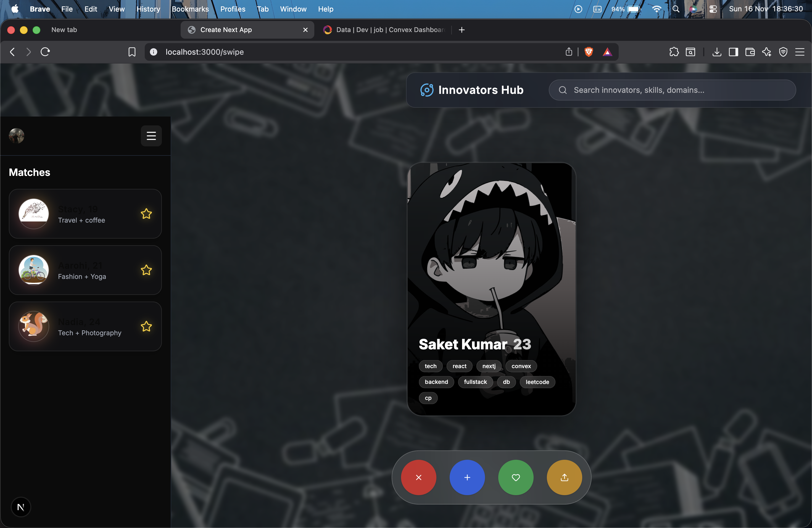
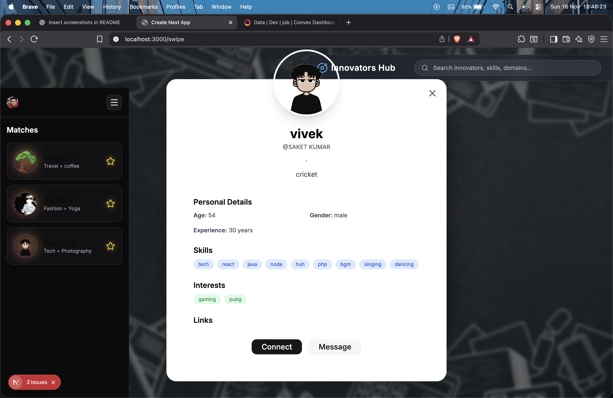
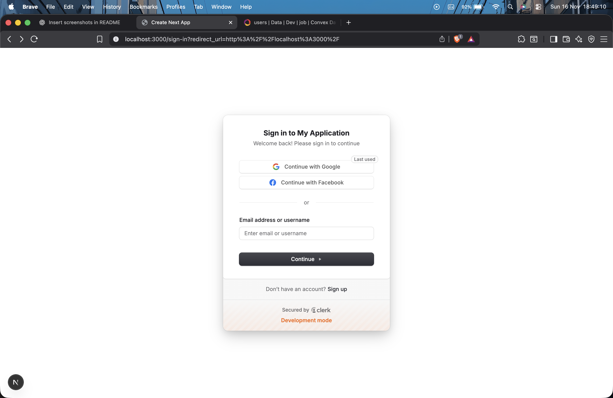
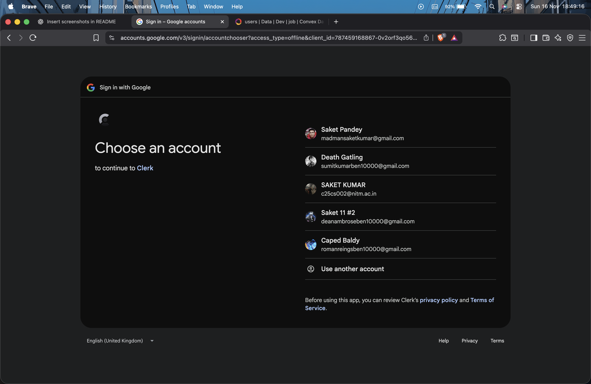
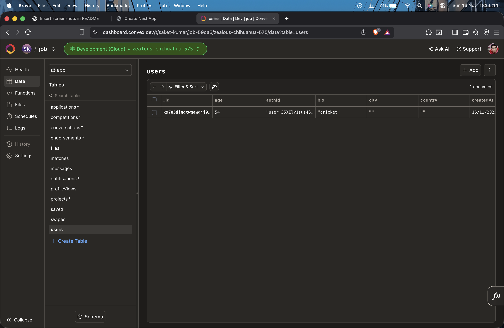

# 🚀 Innovators Hub

Innovators Hub is a swipe-based networking platform built for **developers, founders, builders, and creators**.  
It helps users discover collaborators based on **skills**, **domains**, and **interests**, making it ideal for hackathons, startup teams, and project partnerships.

Built using **Next.js**, **Convex**, **Clerk**, **Framer Motion**, and **ShadCN UI**, the platform delivers a modern, smooth, and fully animated collaboration experience.

---

# 📸 Screenshots

### 🟨 Swipe Interface & Dashboard

Swipe **right** to accept and **left** to skip — a modern, intuitive interface for matching collaborators.



---

### 🟨 Upload Project

Easily upload project ideas to find skilled collaborators.


---

### 🟨 Developer Profile

View detailed developer profiles including skills, interests, and experience.



---

### 🟨 Authentication Page

Simple and clean login/register interface.



---

### 🟨 Google-Based Authentication

Secure and fast authentication using Google OAuth.



---

### 🟨 Onboarding Requirements

New users fill out necessary information to help the platform optimize matches.


---

### 🟨 Convex Database Dashboard

Backend tables and rows powered by Convex.



---

# ✨ Features

## 🔥 Swipe-Based Matching

A smooth and intuitive swipe interface powered by **Framer Motion**.  
Users can:

- Swipe **right** to like
- Swipe **left** to skip
- Tap to view full profile details
- Use quick-action buttons for decision-making

---

## 🪄 Random Avatar Generator

Each new user receives a randomly generated avatar from 24 available illustrations  
(`placeholder/1.svg` → `placeholder/24.svg`).

This ensures a consistent visual identity for users without profile images.

---

## 👤 Profile Details Modal

The expanded profile modal includes:

- Name, age, bio
- Skills & tech stack
- Interests and experience
- Social media links
- “Message” and “Connect” actions

---

## ⭐ Matches Sidebar

A left-side panel showing:

- User avatar
- Name & age
- Interests summary
- Favorite/star action
- Persistent match list

---

## 🔍 Global Search

Search for innovators by:

- Name
- Skills (React, Firebase, UX, etc.)
- Tools / technologies
- Domains (AI, Web, Mobile, etc.)

---

## 🎨 Modern UI & Animations

- ShadCN UI components
- Tailwind CSS
- Lucide icons
- Glassmorphism elements
- Smooth transitions & spring animations
- Fully responsive layout

---

# 🛠️ Tech Stack

## **Frontend**

- Next.js 14 (App Router)
- TypeScript
- Tailwind CSS
- ShadCN UI
- Framer Motion
- Lucide Icons

## **Backend**

- Convex (real-time database + functions)
- Queries & mutations for:
  - Users
  - Swipe actions
  - Matches
  - Skill parsing

## **Authentication**

- Clerk (email, OAuth, Google login)

---

# 📦 Getting Started

Install dependencies:

```bash
npm install
# or
yarn
# or
pnpm install
# or
bun install
```
